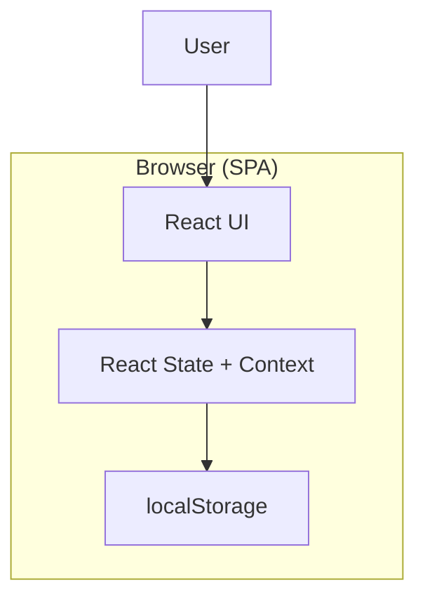
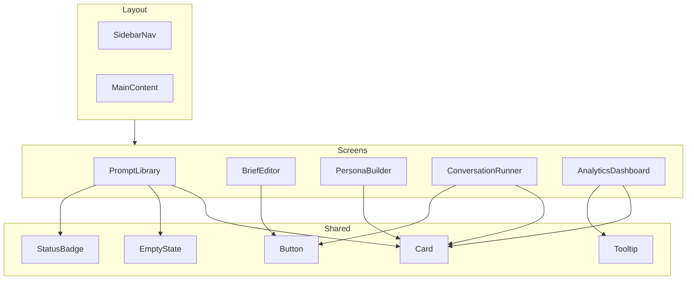
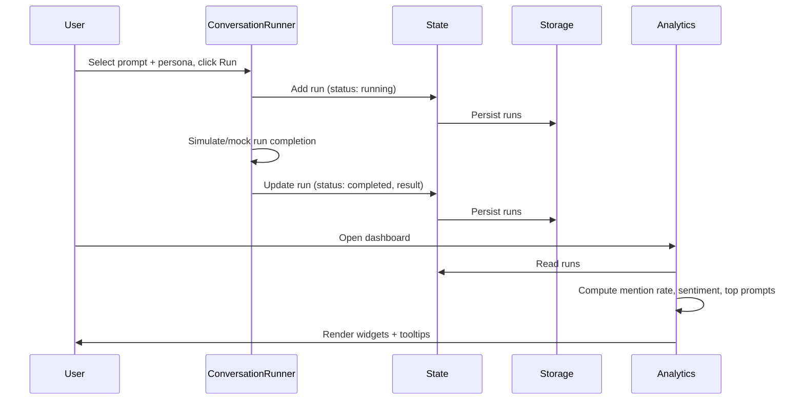
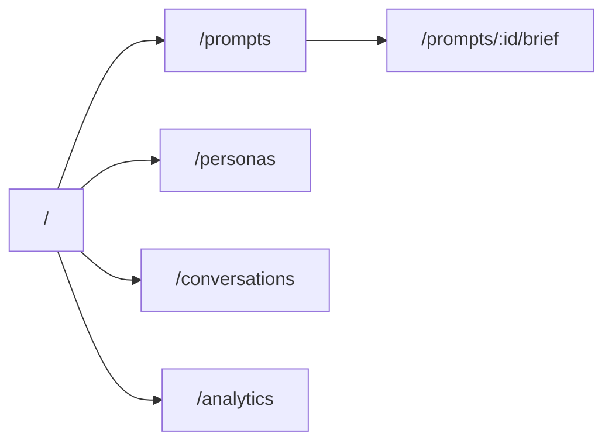

# Architecture Diagrams — Brand-in-AI Monitor

**Last Updated:** 2025-03-12

---

## System Architecture (High-Level)

---

## Component Structure (Logical)

---

## Data Flow (Runs and Analytics)

---

## Route / Screen Map

